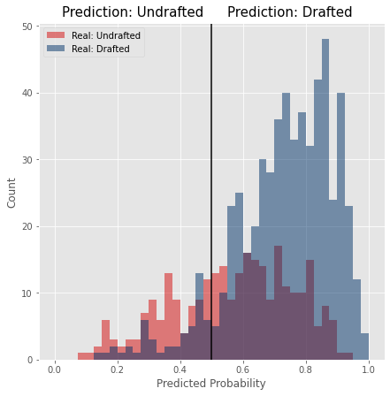
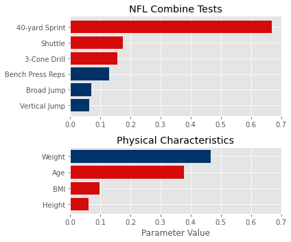
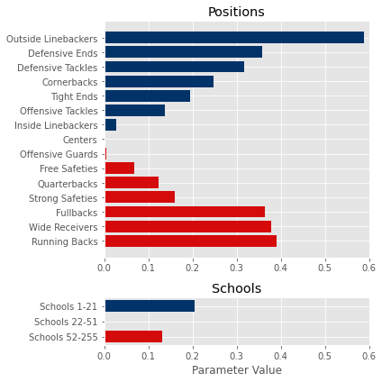

# NFL_Combine_Project
This is the Phase 3 Project for the Flatiron School Data Science Boot Camp.

## Contents of Repository
|File/Folder                  | Description                                                    |
|:----------------------------|:---------------------------------------------------------------|
|student.ipynb                | Jupyter notebook used to perform the analysis.                 |
|student.pdf                  | PDF of Jupyter notebook                                        |
|NFL_Combine_Presentation.pdf | PDF of the non-technical presentation for stakeholders.        |
|Figures                      | Folder containing figures used in the presentation and README. |
|Data                         | The data used in the project and descriptions of the data.     |

## Overview
In this project, I created a model that attempts to predict whether a player will be drafted in the NFL Draft based on their performance in the NFL Combine. Using data from 2009 to 2019, I tried several different types of classification models. The best performing model was a logistic regression that took into account a player's performance in the 6 Combine tests, their physical characteristics, their position, and the school they attended.

## Business Problem
The NFL Combine is an annual event where teams scout promising players. The players complete tests of their athleticism as well as drills specific to the position they play. NFL teams use the results of the Combine along with other criteria to decide which players they will select in the NFL Draft in which teams take turns selecting players.

The goal of this project is to create a model that can be used to predict whether a player will get drafted based on their performance at the Combine. An NFL team could use such a model to determine how likely it is that a given player will be drafted by another team. Using this information, the team can adjust their draft strategy. For example, if a team wants to draft a specific player and the model says that player will not get drafted, then the team knows they can use a later pick or possibly sign the player as an undrafted free agent. On the other hand, if the model predicts that the player will be drafted, then the team will need to use an earlier pick to select that player so that another team does not select them first.

## Stakeholder Audience
The audience for this project would be scouts, managers, and coaches of NFL teams who want to improve their ability to prioritize players in the NFL Draft.

## The Data
The data was downloaded from Kaggle: https://www.kaggle.com/datasets/redlineracer/nfl-combine-performance-data-2009-2019
The data contains the results of the NFL Combine from 2009 to 2019. The columns included are

6 Athletic Tests:
1. 40-yard sprint time
2. Vertical jump height
3. Broad jump distance
4. Number of bench press reps (225 pounds)
5. 3-cone agility test time
6. 20-yard shuttle time

4 Player Attributes:
1. Age
2. Height
3. Weight
4. Body Mass Index (BMI)

And:
1. The last college the player attended
2. The position the player plays
3. The round and pick at which the player was drafted (if drafted)
4. The team that drafted the player (if drafted)
5. Whether or not the player was drafted (target variable)

**Problems with the Data**
The original dataset had some issues that required manual fixing:
1. About 550 players' ages were missing. These were filled by looking up the players online. There were still 20 players whose age I could not find.
2. Two players were listed as defensive backs even though they should have been given more specific positions.
3. The data for the 2018 and 2019 drafts were missing lots of players because it appears the pipeline used to create the original dataset had issues with certain positions. In 2018, all the linebackers were missing and in 2019, linebackers, defensive ends, defensive tackles, offensive guards, and centers were missing.
4. Thirty players were listed as being undrafted even though they were actually drafted.
5. In 2018 and 2019, free safeties and strong safeties were just listed as S (for safety) rather than having a more specific designation. I was able to find the more specific position for each player online.

In addition to manually fixing the errors listed above, I also chose to exclude kickers, punters, and long snappers from the analysis. There just weren't enough of these players and most of them did not actually participate in the 6 Combine drills.

The final dataset includes 3451 players.

Below is a bar chart showing how many players attended the Combine at each position and how many of them ended up being drafted.

**School**

The data contains 255 distinct schools. Some schools sent over 100 players to the Combine while most only sent 1-5. Rather than treating each school as its own category, I put the schools into 3 groups based on how many players they sent to the Combine:
Group 1: The 21 schools that sent the most players to the Combine. These contain many of the powerhouses of college football like Alabama, LSU, Notre Dame, and Ohio State.
Group 2: The next 30 schools as ranked by number of players in the Combine. These contain solid college football programs, many of which player in the Power 5 conferences.
Group 3: The other schools.

There does appear to be a weak trend between the school and whether a player was drafted.
Group 1: 72.0% were drafted.
Group 2: 66.4% were drafted.
Group 3: 62.0% were drafted.

## Creating a Classification Model
Six different types of classification models were tried:
1. Logistic Regression
2. Decision Tree
3. K Nearest Neighbors
4. Naive Bayes
5. Random Forest
6. XGBoost Classifier

With the exception of Naive Bayes, I used scikit learn's implementation within Python. For Naive Bayes, I wrote my own version to work with this specific dataset.

For each type of model, I started by using the default hyperparameters used by scikit learn in order to create a baseline model. I then used GridSearchCV to tune certain hyperparameters. A 75-25 train-test split was used for each model. Performance was evaluated by looking at accuracy, the confusion matrix, and the ROC curve.

## Evaluation

The accuracy of the models on test data ranged from 67% to 73%. Models tended to achieve solid recall of drafted players (over 90%), but struggled with recall of undrafted players (less than 35%). As I will discuss below, recalling drafted players is preferable.

The performance of the models is summarized in the tables below. For each model, I list the accuracy for both the training and the test data as well as the area under curve (AUC) of the ROC curve. I also list some important hyperparameter values.
**Logistic Regression**
|Description                               |C      |Training Accuracy |Test Accuracy| ROC AUC  |
|------------------------------------------|-------|------------------|-------------|----------|
|Baseline, preprocessing ignores position  |1e12   |72%               |73%          |0.730     |
|Preprocessing takes into account position |1e12   |73%               |73%          |0.747     |
|Uses Interaction Terms                    |1e12   |76%               |72%          |0.721     |
|Stricter regularization, no inter terms   |0.1    |73%               |73%          |0.745     |
|Stricter regularization, yes inter terms  |1      |75%               |72%          |0.727     |

**Decision Tree**
|Description                                     |Training Accuracy |Test Accuracy| ROC AUC  |
|------------------------------------------------|------------------|-------------|----------|
|Default Hyperparameters                         |100% (Overfitting)|61%          |0.563     |
|No interaction terms, optimal hyperparameters   |72%               |67%          |0.664     |
|Uses Interaction terms, optimal hyperparameters |72%               |68%          |0.651     |

**K Nearest Neighbors**
|Description                                     |k   |p   |Training Accuracy |Test Accuracy| ROC AUC  |
|------------------------------------------------|----|----|------------------|-------------|----------|
|Default Hyperparameters                         |5   |2   |78%               |69%          |0.637     |
|Positions separated by 10x                      |5   |2   |78%               |68%          |0.652     |
|Uses Interaction terms, optimal hyperparameters |49  |2.5 |73%               |70%          |0.717     |

**Naive Bayes**
|Description                                     |bias     |Training Accuracy |Test Accuracy| ROC AUC  |
|------------------------------------------------|---------|------------------|-------------|----------|
|Default Hyperparameters                         |default  |74%               |71%          |0.715     |
|Use balanced bias                               |balanced |75%               |71%          |0.715     |

**Random Forest**
|Description                                     |Training Accuracy |Test Accuracy| ROC AUC  |
|------------------------------------------------|------------------|-------------|----------|
|Default Hyperparameters                         |100% (Overfitting)|70%          |0.709     |
|No inter terms, optimal hyperparameters         |79%               |70%          |0.720     |
|Used inter terms, optimal hyperparameters       |73%               |70%          |0.729     |

**XGBoost Classifier**
|Description                                     |Training Accuracy |Test Accuracy| ROC AUC  |
|------------------------------------------------|------------------|-------------|----------|
|Default Hyperparameters                         |99% (Overfitting) |68%          |0.691     |
|No inter terms, optimal hyperparameters         |80%               |70%          |0.728     |
|Used inter terms, optimal hyperparameters       |75%               |72%          |0.736     |

**Best Performing Model**
The best performing model was a logistic regression model that used C=0.1 for Lasso regularization. The model achieved 73% accuracy on the test data.

Below is a plot showing histograms of the probability predicted by the model. Anything above 0.5 is predicted to be a drafted player while values below 0.5 mean the player is predicted to not be drafted. Actual drafted players are in blue while undrafted players are in red.

Below is the confusion matrix for the test data:

**False Positives and False Negatives**

The model does a solid job avoiding false negatives (predicting that a player will not be drafted when they actually will), but struggles to reduce false positives (predicting that a player will be drafted when they actually won't be). I could make the balance between false positives and false negatives closer, but it is better to keep false negatives low because that is a worse outcome. If a player is wrongly predicted to go undrafted (false negative), then a team might think they can select him late in the draft only to have that player picked by another team first. On the other hand, if a player is wrongly predicted to be drafted (false positive), that might force the team to use an earlier than necessary pick on them. While this is not ideal, they at least get the player they wanted, unlike in the false negative case.

## Results
While the overall performance of the model was not amazing, there were still some valuable insights about how teams use the NFL Combine to evaluate players.

Below are the parameter values for each Combine test and for the physical characteristics of a player. The larger the bar, the more useful that criteria is for predicting whether a player will be drafted. If the bar is blue, it means that larger values are preferred. For red bars, smaller values are preferred.

The most important test at the Combine is the 40-yard sprint. Speed is a very important attribute for many different positions on the football field, and that is reflected in the model.

The next two most important tests also relate to speed. Both the Shuttle and the 3-cone agility tests require speed, but they also require someone to be quick at changing direction.

The other three tests that relate to jumping ability and physical strength are less important than the speed-based tests, but they do still carry some weight.

The model also contains parameters for a player's position and the school they attended. The parameters for each of these are shown below. In this case, if the bar is blue, it means a higher chance of getting drafted while red means a lower chance of getting drafted.

The top four most drafted positions are all on the defensive side of the ball, with outside linebackers drafted most often.

Of the five positions drafted at the lowest rate, 4 of them are on the offensive side of the ball. Running backs are drafted at the lowest rate, perhaps reinforcing the recent news about how teams are not valuing running backs very highly anymore (this analysis was performed during the 2023 offseason).

The model does show that players from the top 21 schools are drafted more often. Teams do seem to care whether a player played for a bigger football program in college.

## Conclusions
I reached the following conclusions:

1. The NFL Combine does have some influence on whether a given player is drafted, but it is only one piece of the puzzle. A player's performance on athletic tests might give an indication of whether that player has the physicality and speed to cut it in the league, but other information is needed to determine whether the player has the skills and knowledge that are specific to the game of football.
2. The most influential event on the NFL Combine is the 40-yard sprint. Being among the fastest players at a given position can make a huge difference.
3. Teams tend to want to select younger, heavier players who come from bigger college football programs.
4. Defensive players tend to get drafted at a higher rate than offensive players with "skill" positions tending to be drafted at the lowest rate.
5. If a team wants to incorporate a model like this into their draft strategy, it is worthwhile to look at the probability the model outputs for each player rather than just the binary prediction. This way, the team would know how confident they should be in a given prediction.