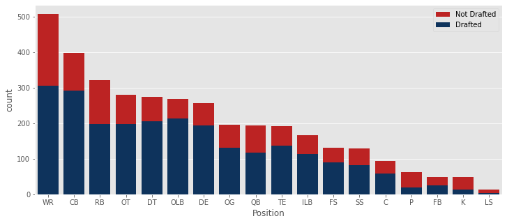

# NFL_Combine_Project
This is the Phase 3 Project for the Flatiron School Data Science Boot Camp.

## Contents of Repository
|File/Folder                  | Description                                                    |
|:----------------------------|:---------------------------------------------------------------|
|student.ipynb                | Jupyter notebook used to perform the analysis.                 |
|student.pdf                  | PDF of Jupyter notebook                                        |
|NFL_Combine_Presentatino.pdf | PDF of the non-technical presentation for stakeholders.        |
|Figures                      | Folder containing figures used in the presentation and README. |
|Data                         | The data used in the project and descriptions of the data.     |

## Overview

## Business Problem
The NFL Combine is an annual event where teams scout promising players. The players complete tests of their athleticism as well as drills specific to the position they play. NFL teams use the results of the Combine along with other criteria to decide which players they will select in the NFL Draft in which teams take turns selecting players.

The goal of this project is to create a model that can be used to predict whether a player will get drafted based on their performance at the Combine. An NFL team could use such a model to determine how likely it is that a given player will be drafted by another team. Using this information, the team can adjust their draft strategy. For example, if a team wants to draft a specific player and the model says that player will not get drafted, then the team knows they can use a later pick or possibly sign the player as an undrafted free agent. On the other hand, if the model predicts that the player will be drafted, then the team will need to use an earlier pick to select that player so that another team does not select them first.

## Stakeholder Audience
The audience for this project would be scouts, managers, and coaches of NFL teams who want to improve their ability to prioritize players in the NFL Draft.

## The Data
The data was downloaded from Kaggle: https://www.kaggle.com/datasets/redlineracer/nfl-combine-performance-data-2009-2019
The data contains the results of the NFL Combine from 2009 to 2019. The columns included are

6 Athletic Tests:
1. 40-yard sprint time
2. Vertical jump height
3. Broad jump distance
4. Number of bench press reps (225 pounds)
5. 3-cone agility test time
6. 20-yard shuttle time

4 Player Attributes:
1. Age
2. Height
3. Weight
4. Body Mass Index (BMI)

And:
1. The last college the player attended
2. The position the player plays
3. The round and pick at which the player was drafted (if drafted)
4. The team that drafted the player (if drafted)
5. Whether or not the player was drafted (target variable)

**Problems with the Data**
The original dataset had some issues that required manual fixing:
1. About 550 players' ages were missing. These were filled by looking up the players online. There were still 20 players whose age I could not find.
2. Two players were listed as defensive backs even though they should have been given more specific positions.
3. The data for the 2018 and 2019 drafts were missing lots of players because it appears the pipeline used to create the original dataset had issues with certain positions. In 2018, all the linebackers were missing and in 2019, linebackers, defensive ends, defensive tackles, offensive guards, and centers were missing.
4. Thirty players were listed as being undrafted even though they were actually drafted.
5. In 2018 and 2019, free safeties and strong safeties were just listed as S (for safety) rather than having a more specific designation. I was able to find the more specific position for each player online.

In addition to manually fixing the errors listed above, I also chose to exclude kickers, punters, and long snappers from the analysis. There just weren't enough of these players and most of them did not actually participate in the 6 Combine drills.

The final dataset includes 3451 players.

Below is a bar chart showing how many players attended the Combine at each position and how many of them ended up being drafted.

**School**

The data contains 255 distinct schools. Some schools sent over 100 players to the Combine while most only sent 1-5. Rather than treating each school as its own category, I put the schools into 3 groups based on how many players they sent to the Combine:
Group 1: The 21 schools that sent the most players to the Combine. These contain many of the powerhouses of college football like Alabama, LSU, Notre Dame, and Ohio State.
Group 2: The next 30 schools as ranked by number of players in the Combine. These contain solid college football programs, many of which player in the Power 5 conferences.
Group 3: The other schools.

There does appear to be a weak trend between the school and whether a player was drafted.
Group 1: 72.0% were drafted.
Group 2: 66.4% were drafted.
Group 3: 62.0% were drafted.

## Creating Classification Model
Six different types of classification models were tried:
1. Logistic Regression
2. Decision Tree
3. K Nearest Neighbors
4. Naive Bayes
5. Random Forest
6. XGBoost Classifier

With the exception of Naive Bayes, I used scikit learn's implementation within Python. For Naive Bayes, I wrote my own version to work with this specific dataset.

## Results

## Recommendations

**Example**